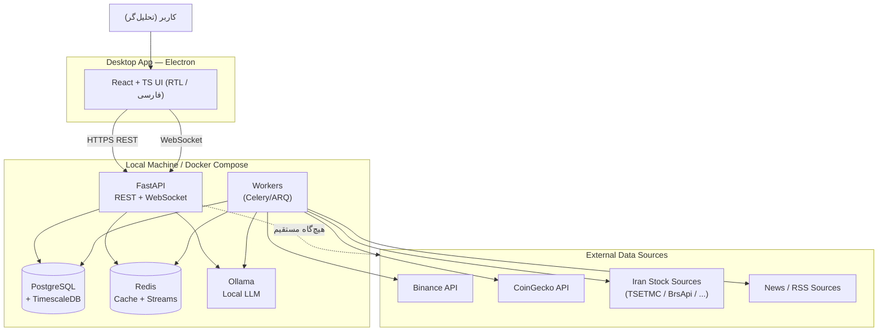
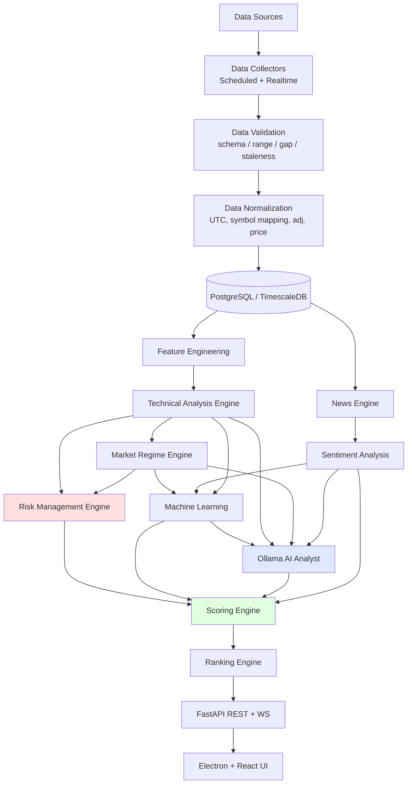
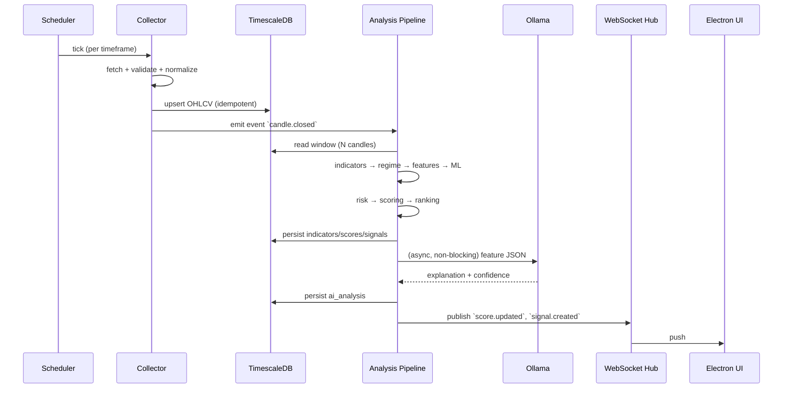

# ۱) معماری کامل سیستم + Architecture Diagram

## ۱.۱ سبک معماری

- **Modular Monolith** در Backend (نه Microservices).
  دلیل: این یک نرم‌افزار Desktop تک‌کاربره است؛ Microservices فقط هزینه عملیاتی اضافه می‌کند.
  اما مرزهای ماژولی مثل میکروسرویس **سخت‌گیرانه** هستند تا در آینده جداسازی ممکن باشد.
- **Hexagonal / Ports & Adapters**: هسته دامنه (Domain) هیچ چیزی از HTTP، DB یا Ollama نمی‌داند.
- **Event-Driven داخلی**: بین لایه‌ها از صف Redis (Stream) استفاده می‌شود تا Collectorها بتوانند مستقل از Analyzerها کار کنند.
- **CQRS سبک**: مسیر نوشتن (Collector → DB) از مسیر خواندن (API → Read Models / Materialized Views) جداست.

---

## ۱.۲ دیاگرام کلان (C4 — Level 1: Context)

> نکته I1/I2: UI فقط با API حرف می‌زند. API هرگز مستقیم به منبع خارجی وصل نمی‌شود؛ همه I/O خارجی از طریق Workerهاست تا latency و rate-limit مسیر کاربر را خراب نکند.

---

## ۱.۳ دیاگرام Pipeline تحلیل (خواسته بند ۲)

**نکته حیاتی (I6/I7):** `Risk Engine` ورودی خود را از TA و Regime می‌گیرد، **نه** از AI. و در `Scoring Engine`
یک مرحله `Risk Veto` وجود دارد که می‌تواند خروجی را صرف‌نظر از هر امتیاز دیگری به `WAIT`/`AVOID` تبدیل کند.

---

## ۱.۴ دیاگرام کامپوننت‌ها (C4 — Level 2)

```mermaid
graph LR
    subgraph API_Layer["API Layer — backend/app/api"]
        R1["/assets"]
        R2["/market"]
        R3["/signals"]
        R4["/analysis"]
        R5["/news"]
        R6["/backtest"]
        R7["/paper"]
        R8["/alerts"]
        R9["/admin, /health"]
        WS["/ws/stream"]
    end

    subgraph Services["Service Layer — app/services"]
        S1[AssetService]
        S2[MarketService]
        S3[ScoringService]
        S4[RankingService]
        S5[SignalService]
        S6[NewsService]
        S7[BacktestService]
        S8[PaperTradingService]
        S9[AlertService]
    end

    subgraph Domain["Domain / Engines"]
        E1[Indicators Engine]
        E2[Regime Engine]
        E3[Sentiment Engine]
        E4[ML Engine]
        E5[Risk Engine]
        E6[Scoring Engine]
        E7[Decision Policy]
    end

    subgraph Ports["Ports (ABC Interfaces)"]
        P1[MarketDataProvider]
        P2[NewsProvider]
        P3[AIProvider]
        P4[Repository...]
    end

    subgraph Adapters["Adapters"]
        A1[BinanceProvider]
        A2[CoinGeckoProvider]
        A3[TsetmcProvider]
        A4[RSSNewsProvider]
        A5[OllamaProvider]
        A6[OpenAIProvider*]
        A7[SqlAlchemyRepos]
        A8[MockProviders — TEST ONLY]
    end

    API_Layer --> Services --> Domain
    Domain --> Ports
    Services --> Ports
    Ports --> Adapters
```

`*` = پیاده‌سازی اختیاری آینده، بدون تغییر معماری.

---

## ۱.۵ لایه‌ها و مسئولیت‌ها

| لایه | مسئولیت | نمی‌تواند |
|---|---|---|
| **api/** | Routing, Validation (Pydantic), AuthZ محلی, Serialization | منطق کسب‌وکار، دسترسی مستقیم ORM |
| **services/** | Orchestration، تراکنش، Cache policy | محاسبه اندیکاتور، فراخوانی مستقیم HTTP خارجی |
| **domain engines/** | محاسبات خالص (Pure)، بدون I/O | دسترسی به DB یا شبکه |
| **providers/** | ترجمه API خارجی به مدل داخلی + retry/backoff | تصمیم‌گیری تحلیلی |
| **collectors/** | زمان‌بندی، دریافت، اعتبارسنجی، ذخیره | تحلیل |
| **database/** | Repository ها، Migration | منطق تحلیلی |

**قانون Pure Core:** موتورهای `indicators`, `risk`, `scoring`, `regime` توابع خالص روی `pandas.DataFrame`
هستند. این باعث می‌شود دقیقاً همان کد در Live و Backtest اجرا شود → «تفاوت Backtest/Live» حذف می‌شود.

---

## ۱.۶ مدل اجرای زمانی (Runtime / Scheduling)

**قانون طلایی:** AI در **مسیر بحرانی نیست**. اگر Ollama پایین باشد، سیستم کامل کار می‌کند و
فقط فیلد `ai_analysis = null` با `degraded: true` برمی‌گردد.

---

## ۱.۷ استراتژی Concurrency

| نوع کار | ابزار | دلیل |
|---|---|---|
| API | `async` FastAPI + `asyncpg` | IO-bound |
| Realtime WS ingest | `asyncio` task per exchange stream | IO-bound |
| Collect (HTTP) | worker pool، rate-limiter توکن‌باکت per-source | محدودیت API |
| Indicator/ML compute | ProcessPool (CPU-bound، آزادسازی GIL) | CPU-bound |
| LLM inference | صف جداگانه با concurrency=1..2 | GPU/RAM محدود |

---

## ۱.۸ حالت‌های اجرا (Run Modes)

| Mode | داده | AI | استفاده |
|---|---|---|---|
| `live` | فقط منابع واقعی | فعال | Production |
| `replay` | داده تاریخی DB با ساعت مجازی | فعال | Backtest / Debug |
| `mock` | MockProvider | Null/Fake AI | فقط تست خودکار |

در `live`، اگر Provider پاسخ ندهد → هیچ داده‌ای ساخته نمی‌شود؛ رکورد `data_source_health` با
`status=down` ثبت و در UI بنر قرمز «داده ناموجود — منبع X» نمایش داده می‌شود (بند ۲۹).
