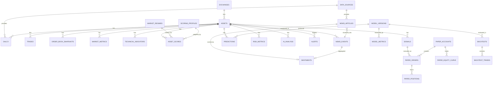

# ۳) Database ERD + جداول + استراتژی Time-Series

## ۳.۱ اصول

1. همه زمان‌ها `TIMESTAMPTZ` و **UTC**. تبدیل به شمسی/محلی فقط در UI.
2. همه قیمت‌ها `NUMERIC(38,12)` — **هرگز float** برای مقادیر پولی. (اندیکاتورها می‌توانند `DOUBLE PRECISION` باشند.)
3. هر رکورد داده خام دارای `source_id`, `ingested_at`, `quality_score`, `validation_status`.
4. جداول سری‌زمانی → **Hypertable** (TimescaleDB) با `chunk_time_interval` متناسب.
5. Idempotency: کلید طبیعی `(asset_id, timeframe, ts, source_id)` با `ON CONFLICT DO UPDATE`.
6. هیچ `DELETE` روی داده تاریخی؛ اصلاح با نسخه‌گذاری (`revision`).

---

## ۳.۲ ERD



---

## ۳.۳ جداول (مرجع کامل)

### گروه A — مرجع و متادیتا

#### `exchanges`
| ستون | نوع | توضیح |
|---|---|---|
| id | `SMALLSERIAL PK` | |
| code | `TEXT UNIQUE` | `BINANCE`, `TSE`, `IFB` |
| name | `TEXT` | |
| market_type | `ENUM(crypto, iran_stock)` | |
| timezone | `TEXT` | `UTC` / `Asia/Tehran` |
| trading_calendar | `JSONB` | ساعات و روزهای معاملاتی، تعطیلات رسمی |
| is_active | `BOOL` | |

#### `assets`
| ستون | نوع | توضیح |
|---|---|---|
| id | `BIGSERIAL PK` | |
| exchange_id | `FK exchanges` | |
| symbol | `TEXT` | `BTCUSDT` / `فملی` |
| isin | `TEXT NULL` | برای بورس ایران (کلید پایدار) |
| tsetmc_ins_code | `TEXT NULL UNIQUE` | شناسه یکتای نماد در TSETMC |
| name_fa / name_en | `TEXT` | |
| asset_class | `ENUM(spot_crypto, perp, stock, etf, index, commodity_fund)` | |
| sector_id | `FK sectors NULL` | صنعت (بورس ایران) |
| base_currency / quote_currency | `TEXT` | |
| tick_size, lot_size | `NUMERIC` | |
| listed_at, delisted_at | `TIMESTAMPTZ` | جلوگیری از **Survivorship Bias** |
| status | `ENUM(active, suspended, delisted)` | |
| meta | `JSONB` | |
| UNIQUE | `(exchange_id, symbol)` | |

> **مهم:** `delisted_at` و رکوردهای نمادهای حذف‌شده باید نگهداری شوند، وگرنه Backtest دچار Survivorship Bias می‌شود.

#### `sectors` (بورس ایران)
`id, code, name_fa, parent_id` — برای Regime صنعتی (بند ۷).

#### `data_sources`
| ستون | نوع |
|---|---|
| id `SMALLSERIAL PK`, code `TEXT UNIQUE`, name, kind `ENUM(market,news,onchain,derivatives)`, base_url, auth_type, rate_limit_json `JSONB`, priority `SMALLINT`, is_enabled `BOOL`, notes |

#### `data_source_health`
`id, source_id FK, checked_at, status ENUM(up,degraded,down), latency_ms, error_code, error_message, consecutive_failures`
→ منبعِ بنر قرمز UI در بند ۲۹.

#### `corporate_actions` (بورس ایران — حیاتی)
`id, asset_id, type ENUM(split, capital_increase, dividend, symbol_change), ex_date, ratio NUMERIC, details JSONB`
→ برای ساخت **قیمت تعدیل‌شده (adjusted)**. بدون این، تمام اندیکاتورها و Backtest بورس ایران غلط می‌شوند.

---

### گروه B — سری‌زمانی بازار (Hypertable)

#### `ohlcv`  ⏱ *hypertable*
| ستون | نوع |
|---|---|
| asset_id `BIGINT` | |
| timeframe `ENUM(1m,5m,15m,30m,1h,4h,1d,1w)` | |
| ts `TIMESTAMPTZ` | زمان **باز شدن** کندل |
| open, high, low, close `NUMERIC(38,12)` | |
| volume `NUMERIC(38,12)` | |
| quote_volume `NUMERIC NULL`, trade_count `INT NULL` | |
| close_adj `NUMERIC NULL` | تعدیل‌شده (سهام) |
| is_final `BOOL` | کندل بسته یا در حال شکل‌گیری |
| source_id `SMALLINT`, ingested_at, quality_score `SMALLINT`, validation_status `ENUM` | |
| **PK** | `(asset_id, timeframe, ts, source_id)` |

```sql
SELECT create_hypertable('ohlcv','ts', chunk_time_interval => INTERVAL '7 days');
CREATE INDEX ON ohlcv (asset_id, timeframe, ts DESC);
ALTER TABLE ohlcv SET (timescaledb.compress,
      timescaledb.compress_segmentby = 'asset_id, timeframe');
SELECT add_compression_policy('ohlcv', INTERVAL '30 days');
```
**Continuous Aggregates:** `1m → 5m → 15m → 1h → 4h → 1d` به‌صورت خودکار، تا داده بالادستی یک بار ذخیره شود.

#### `trades` ⏱ *hypertable* (فقط برای نمادهای منتخب)
`asset_id, ts, price, qty, side ENUM(buy,sell), trade_id, source_id`
⚠️ حجم بسیار بالا → retention policy کوتاه (مثلاً ۷ روز) + تجمیع به `market_metrics`.

#### `order_book_snapshots` ⏱ *hypertable*
`asset_id, ts, bids JSONB, asks JSONB, depth_levels SMALLINT, imbalance NUMERIC, spread NUMERIC, source_id`
snapshot با فاصله ثابت (مثلاً هر ۱۰ ثانیه، top-20) نه هر تغییر.

#### `market_metrics` ⏱ *hypertable*
معیارهای غیر-OHLCV در قالب long-format (توسعه‌پذیر بدون migration):
`asset_id NULL, ts, metric_code TEXT, value NUMERIC, meta JSONB, source_id`
نمونه `metric_code`: `funding_rate`, `open_interest`, `long_short_ratio`, `liquidations_long_usd`,
`exchange_inflow`, `exchange_outflow`, `whale_tx_count`, `btc_dominance`, `stablecoin_mcap`,
`tse_total_index`, `tse_equal_weight_index`, `tse_trade_value`, `tse_retail_buy_power`, `tse_money_flow`.

> چرا long-format؟ چون فهرست معیارها (بند ۱۰) باز و در حال رشد است و نباید هر معیار جدید نیاز به تغییر schema داشته باشد.

---

### گروه C — لایه تحلیلی

#### `technical_indicators` ⏱ *hypertable*
`asset_id, timeframe, ts, indicator_code TEXT, params_hash TEXT, value NUMERIC, values JSONB NULL, computed_at, engine_version TEXT`
- `values JSONB` برای اندیکاتورهای چندخروجی (MACD، Bollinger، Ichimoku، Stochastic).
- `params_hash` اجازه می‌دهد چند پیکربندی هم‌زمان ذخیره شود (RSI-14 و RSI-7).
- **PK**: `(asset_id, timeframe, ts, indicator_code, params_hash)`

#### `feature_snapshots` ⏱ *hypertable*
ورودی واحد برای ML و AI (یک ردیف = یک بردار ویژگی در یک لحظه):
`asset_id, timeframe, ts, feature_set_version TEXT, features JSONB, feature_vector REAL[], created_at`
→ همان چیزی که به ML و به Ollama داده می‌شود، تا **Train/Serve Skew** صفر شود.

#### `support_resistance`
`asset_id, timeframe, computed_at, level NUMERIC, kind ENUM(support,resistance), strength NUMERIC, touches INT, method TEXT, valid_until`

#### `market_regimes` ⏱ *hypertable*
`scope ENUM(global_crypto, asset, tse_market, sector), scope_ref TEXT, ts, regime ENUM(BULL,BEAR,SIDEWAYS,HIGH_VOLATILITY,LOW_VOLATILITY), confidence NUMERIC, indicators JSONB, method TEXT, model_version_id NULL`

#### `scoring_profiles`
`id, name, is_active BOOL, weights JSONB, thresholds JSONB, created_at, created_by, notes`
→ بند ۱۱: وزن‌ها **در DB**، نه در کد. تغییر وزن = پروفایل جدید، نه ویرایش مخرب (برای قابلیت بازتولید).

#### `asset_scores` ⏱ *hypertable*
| ستون | توضیح |
|---|---|
| asset_id, timeframe, ts | |
| technical, momentum, volume, market, news, sentiment, liquidity `NUMERIC(5,2)` | 0..100 |
| risk `NUMERIC(5,2)` | 0..100 |
| ai_confidence `NUMERIC(5,2)` NULL | |
| final_score `NUMERIC(5,2)` | 0..100 |
| recommendation `ENUM(BUY_CANDIDATE, WATCH, HOLD, WAIT, AVOID, RESEARCH_ONLY)` | |
| scoring_profile_id FK, regime_id, components JSONB | شکست کامل محاسبه برای Explainability |
| data_completeness `NUMERIC` | درصد فیچرهای موجود |

#### `risk_metrics` ⏱ *hypertable*
`asset_id, timeframe, ts, atr, atr_pct, realized_vol_7d/30d, beta_vs_market, max_drawdown_30d/90d, var_95, cvar_95, liquidity_score, illiquidity_flag, gap_risk, halt_risk (برای بورس ایران: صف/توقف نماد), position_risk_pct`

---

### گروه D — اخبار

#### `news_articles`
`id, source_id, external_id, url UNIQUE, url_hash, title, description, body TEXT, language, author, published_at, fetched_at, simhash BIGINT, embedding VECTOR(384) NULL, event_id FK NULL, raw JSONB`

#### `news_events`
`id, canonical_title, first_seen_at, last_seen_at, article_count INT, source_count INT, category ENUM(regulation, hack, listing, macro, earnings, policy, partnership, ...), scope ENUM(global, market, sector, asset), importance NUMERIC, dedup_method, centroid_embedding VECTOR NULL`

#### `news_event_assets`
`event_id, asset_id, relevance NUMERIC, extraction_method ENUM(dictionary, ner, llm)` — رابطه چند‌به‌چند.

#### `sentiments`
`id, subject_type ENUM(article,event,asset_aggregate), subject_id, label ENUM(positive,negative,neutral), score NUMERIC(-1..1), intensity ENUM(low,medium,high,critical), impact_score NUMERIC(0..100), confidence NUMERIC(0..1), model TEXT, model_version, computed_at`

---

### گروه E — ML، پیش‌بینی، ارزیابی

#### `model_versions`
`id, name, task ENUM(direction_clf, vol_reg, regime_clf), algo, version TEXT, trained_at, train_range, valid_range, feature_set_version, hyperparams JSONB, artifact_path, status ENUM(training, validated, backtested, paper, production, retired), promoted_at, retired_at, parent_version_id`

#### `model_metrics`
`id, model_version_id, stage ENUM(train, validation, backtest, paper, live), window_start, window_end, metric_code, value` — شامل accuracy, precision, recall, f1, roc_auc, brier, win_rate, avg_return, profit_factor, max_drawdown, sharpe, sortino, expectancy, calibration_error.

#### `predictions` ⏱ *hypertable*
| ستون | توضیح |
|---|---|
| id, asset_id, timeframe, ts (زمان پیش‌بینی) | |
| horizon `INTERVAL` | مثلاً ۲۴ ساعت |
| model_version_id, scoring_profile_id | |
| predicted_direction `ENUM(up,down,neutral)`, predicted_prob `NUMERIC` | |
| predicted_move_atr `NUMERIC` | حرکت مورد انتظار بر حسب ATR — نه قیمت مطلق |
| features_snapshot_ref | |
| **resolve_at** `TIMESTAMPTZ` | زمانی که باید ارزیابی شود |
| **actual_return** `NUMERIC NULL`, **actual_direction** NULL, **is_correct** `BOOL NULL`, resolved_at NULL | توسط Resolver Job پر می‌شود |

#### `signals`
`id, asset_id, timeframe, created_at, direction ENUM(long, short, none), entry NUMERIC, stop_loss, take_profit_1, take_profit_2, rr_ratio, position_risk_pct, confidence, opportunity_score, risk_score, recommendation, rationale TEXT, ai_analysis_id NULL, model_version_id NULL, scoring_profile_id, status ENUM(active, expired, invalidated, hit_tp1, hit_tp2, hit_sl), expires_at, resolved_at, outcome JSONB`

#### `ai_analysis`
`id, asset_id, timeframe, created_at, provider TEXT, model TEXT, prompt_version, input_features JSONB, output JSONB, summary_fa TEXT, contradictions JSONB, risks JSONB, ai_confidence NUMERIC, latency_ms, tokens_in, tokens_out, status ENUM(ok, invalid_json, timeout, refused, degraded)`

---

### گروه F — Backtest و Paper Trading

#### `backtests`
`id, name, strategy_code, strategy_params JSONB, scoring_profile_id, model_version_id NULL, universe JSONB, timeframe, start_at, end_at, method ENUM(simple_split, walk_forward, purged_kfold), costs JSONB (fee, slippage, spread), status, created_at, finished_at, metrics JSONB, equity_curve_ref`

#### `backtest_trades`
`id, backtest_id, asset_id, side, entry_ts, entry_price, exit_ts, exit_price, qty, fees, pnl, pnl_pct, r_multiple, exit_reason ENUM(tp1, tp2, sl, time, signal_flip), mae, mfe, bars_held`

#### `paper_accounts`
`id, name, base_currency, initial_balance, current_balance, equity, max_positions, risk_per_trade_pct, created_at, is_active, config JSONB`

#### `paper_orders`
`id, account_id, signal_id NULL, asset_id, side, type ENUM(market, limit, stop), qty, requested_price, fill_price, fill_ts, status ENUM(pending, filled, partially_filled, rejected, canceled), fees, slippage_model, reject_reason`

#### `paper_positions`
`id, account_id, asset_id, side, qty, avg_entry, stop_loss, take_profit_1, take_profit_2, opened_at, closed_at, realized_pnl, unrealized_pnl, status, linked_signal_id`

#### `paper_equity_curve` ⏱ *hypertable*
`account_id, ts, equity, cash, positions_value, drawdown, open_positions_count`

---

### گروه G — سیستم

#### `alert_rules`
`id, name, scope ENUM(asset, market, global), asset_id NULL, condition_type ENUM(breakout, volume_spike, rsi_overbought, rsi_oversold, macd_cross, news_impact, price_move, risk_change, ai_score_change), params JSONB, timeframe, channels JSONB (desktop/telegram/email), cooldown_seconds, is_enabled`

#### `alert_events`
`id, rule_id, asset_id, triggered_at, payload JSONB, delivery_status JSONB, acknowledged_at`

#### `system_logs`
`id, ts, level, logger, event_code, message, context JSONB, trace_id, span_id` (لاگ ساختاریافته؛ داده حساس ماسک می‌شود — بند ۲۵)

#### `job_runs`
`id, job_name, started_at, finished_at, status, items_processed, items_failed, error, metrics JSONB` — رصد سلامت Collectorها.

#### `user_settings` / `user_drawings`
تنظیمات UI و اشیای ترسیمی چارت (Local، تک‌کاربره).

---

## ۳.۴ برآورد حجم (برای تصمیم درباره Universe)

فرض: ۱۰۰ کریپتو + ۷۰۰ نماد بورس = ۸۰۰ دارایی.

| سناریو | ردیف/سال | حجم خام تقریبی | با Compression |
|---|---|---|---|
| فقط `1d` | 800 × 250 = 200K | ~40 MB | ~5 MB |
| `1h` | 800 × 8,760 = 7M | ~1.2 GB | ~120 MB |
| `15m` | 800 × 35K = 28M | ~5 GB | ~500 MB |
| `1m` (۱۰۰ کریپتو فقط) | 100 × 525K = 52M | ~9 GB | ~900 MB |
| `technical_indicators` (۲۰ اندیکاتور × 1h) | ~140M | ~15 GB | ~1.5 GB |

**نتیجه معماری:** ذخیره اندیکاتورها برای همه ترکیب‌ها گران است.
راهبرد: اندیکاتورها فقط برای **timeframeهای تحلیلی (1h, 4h, 1d)** persist می‌شوند؛
برای timeframeهای پایین، on-the-fly محاسبه و در Redis کش می‌شوند (TTL = طول کندل).
