# ۵) Data Flow — جمع‌آوری، اعتبارسنجی، نرمال‌سازی

## ۵.۱ نمای کلی

```mermaid
flowchart LR
    subgraph SRC[Sources]
      B[Binance REST/WS]
      C[CoinGecko REST]
      T[Iran Stock Source]
      N[News RSS/API]
    end

    subgraph COL[Collector Layer]
      RL[Rate Limiter<br/>token bucket per source]
      RT[Retry + Exp. Backoff + Jitter]
      CB[Circuit Breaker]
    end

    subgraph VAL[Validation]
      V1[Schema Check<br/>Pydantic]
      V2[Range Check<br/>h>=l, o/c in range, vol>=0]
      V3[Continuity Check<br/>gap / duplicate ts]
      V4[Staleness Check]
      V5[Cross-Source Check<br/>deviation > X%]
    end

    subgraph NRM[Normalization]
      N1[UTC timestamps]
      N2[Symbol mapping<br/>canonical id]
      N3[Decimal precision]
      N4[Corporate action adjust<br/>سهام]
      N5[Timeframe alignment]
    end

    SRC --> COL --> VAL --> NRM --> DB[(TimescaleDB)]
    VAL -->|fail| Q[(quarantine table<br/>+ system_logs)]
    DB --> EV[[Redis Stream<br/>candle.closed]]
    EV --> ANL[Analysis Pipeline]
```



---

## ۵.۲ Provider Interface (Port)

```text
MarketDataProvider (ABC)
  ├─ capabilities() -> set[Capability]     # ohlcv, ticker, orderbook, funding, oi, ...
  ├─ list_symbols() -> list[SymbolInfo]
  ├─ get_ohlcv(symbol, timeframe, start, end) -> list[Candle]
  ├─ get_ticker(symbol) -> Ticker
  ├─ get_order_book(symbol, depth) -> OrderBook
  ├─ stream_trades(symbols) -> AsyncIterator[Trade]      # اختیاری
  └─ health() -> ProviderHealth

CryptoDataProvider(MarketDataProvider)
  └─ + get_funding_rate, get_open_interest, get_long_short_ratio, get_liquidations

IranStockDataProvider(MarketDataProvider)
  └─ + get_market_index, get_equal_weight_index, get_client_type_flow (حقیقی/حقوقی),
      get_order_queue (صف خرید/فروش), get_sector_data, get_corporate_actions

NewsProvider (ABC)     -> fetch(since) -> list[RawArticle]
SentimentProvider(ABC) -> score(texts) -> list[SentimentResult]
AIProvider (ABC)       -> analyze(features) -> AIAnalysis
```

**Registry + Capability-based routing:**
هر درخواست داده به Providerها بر اساس `capability` و `priority` مسیردهی می‌شود.
اگر Provider اول fail کند → Provider دوم (fallback chain). منبعِ هر رکورد در `source_id` ثبت می‌شود.

**Mock Providers** فقط در پکیج `tests/` یا `providers/mock/` با گارد:
```
if settings.env == "production" and settings.data_mode == "mock":
    raise ConfigurationError("Mock providers are forbidden in production")
```

---

## ۵.۳ زمان‌بندی جمع‌آوری

| Job | بازار | تناوب | منبع | یادداشت |
|---|---|---|---|---|
| `crypto.ohlcv.1m` | کریپتو | هر ۱ دقیقه (WS kline) | Binance WS | فقط Top-N |
| `crypto.ohlcv.backfill` | کریپتو | یک‌بار + روزانه ترمیم | Binance REST | تاریخچه ۵ ساله |
| `crypto.ticker` | کریپتو | ۵ ثانیه | Binance WS | |
| `crypto.orderbook` | کریپتو | ۱۰ ثانیه snapshot | Binance | top-20 |
| `crypto.derivatives` | کریپتو | ۵ دقیقه | Binance Futures | funding, OI, L/S ratio |
| `crypto.global` | کریپتو | ۱۰ دقیقه | CoinGecko | BTC.D, Total MCap |
| `iran.market_watch` | بورس | ۳۰ ثانیه (در ساعت بازار) | Iran source | قیمت + حجم + صف |
| `iran.indices` | بورس | ۱ دقیقه (در ساعت بازار) | Iran source | شاخص کل/هم‌وزن |
| `iran.client_type` | بورس | ۵ دقیقه | Iran source | حقیقی/حقوقی |
| `iran.eod` | بورس | ۱ بار پس از بسته شدن | Iran source | تثبیت روز + تعدیل |
| `news.poll` | هردو | ۳–۱۰ دقیقه بسته به منبع | RSS/API | |
| `analysis.on_candle_close` | هردو | رویدادی | — | مصرف‌کننده Stream |
| `predictions.resolve` | هردو | هر ۱۵ دقیقه | — | بستن پیش‌بینی‌های سررسیده |

**Market Calendar Awareness:** برای بورس ایران، خارج از ساعت معاملات (۹:۰۰–۱۲:۳۰ به وقت تهران، روزهای کاری)
هیچ Poll ای انجام نمی‌شود — هم منبع را اذیت نمی‌کند، هم داده کاذب تولید نمی‌شود.

---

## ۵.۴ سیاست خطا و تاب‌آوری

| مکانیزم | مشخصات |
|---|---|
| **Retry** | حداکثر ۵ تلاش؛ فقط برای خطاهای گذرا (`429`, `5xx`, timeout, connection reset) |
| **Backoff** | نمایی: `min(base * 2^n, 60s)` + jitter تصادفی ±۲۰٪ |
| **`Retry-After`** | اگر header موجود باشد، بر backoff اولویت دارد |
| **Circuit Breaker** | ۵ خطای متوالی → باز شدن مدار برای ۶۰ ثانیه → نیمه‌باز با ۱ درخواست آزمایشی |
| **Rate Limiter** | Token bucket در Redis، مشترک بین همه Workerها، بر اساس weight واقعی endpoint |
| **Idempotency** | `ON CONFLICT (asset_id, timeframe, ts, source_id) DO UPDATE` |
| **Gap Detection** | job روزانه: کندل‌های مفقود را پیدا و backfill می‌کند؛ گزارش در `job_runs` |
| **Quarantine** | داده مردود در جدول `data_quarantine` با دلیل ذخیره می‌شود (نه دور ریخته می‌شود) |
| **Degraded Mode** | منبع down → API فیلد مربوطه را `null` + `degraded: ["funding_rate"]` برمی‌گرداند؛ Score با `data_completeness < 1` و `confidence` کاهش‌یافته محاسبه می‌شود |

---

## ۵.۵ قواعد اعتبارسنجی (نمونه‌ها)

| قانون | اقدام در صورت نقض |
|---|---|
| `high >= max(open, close)` و `low <= min(open, close)` | reject → quarantine |
| `volume >= 0` | reject |
| `ts` هم‌تراز با مرز timeframe | normalize یا reject |
| `ts` در آینده (> now + 5s) | reject |
| پرش قیمت > ۵۰٪ در یک کندل بدون تأیید منبع دوم | flag `suspicious`، `quality_score` پایین، استفاده در ML: خیر |
| staleness > 3× طول timeframe | `status=stale`، نمایش در UI |
| اختلاف > ۲٪ بین دو منبع برای یک قیمت | ثبت `cross_source_mismatch`، منبع با priority بالاتر برنده |

`quality_score` (0..100) از این قواعد ساخته می‌شود و در `feature_snapshots` و در `confidence` نهایی اثر دارد.

---

## ۵.۶ نرمال‌سازی نمادها

مسئله: `BTCUSDT` (Binance) ≠ `bitcoin` (CoinGecko) ≠ `BTC`.
راه‌حل: جدول `symbol_aliases(asset_id, source_id, external_symbol, external_id)` و یک
`SymbolResolver` که در بارگذاری اولیه ساخته و در Redis کش می‌شود.

برای بورس ایران: کلید پایدار **`tsetmc_ins_code`** است، نه نام نماد (نام نماد تغییر می‌کند: «فملی» → …).
تغییر نام در `corporate_actions` با نوع `symbol_change` ثبت می‌شود.

---

## ۵.۷ تعدیل قیمت سهام (Adjusted Price)

بدون تعدیل، افزایش سرمایه ۱۰۰٪ مثل سقوط ۵۰٪ دیده می‌شود و همه اندیکاتورها و Backtest خراب می‌شوند.

```
adj_factor(t) = Π (ratio_i)  برای همه corporate actions با ex_date > t
close_adj(t)  = close(t) × adj_factor(t)
```
- اندیکاتورها و ML روی `close_adj` محاسبه می‌شوند.
- نمایش چارت به‌صورت پیش‌فرض `adjusted` با امکان سوییچ به `raw`.
