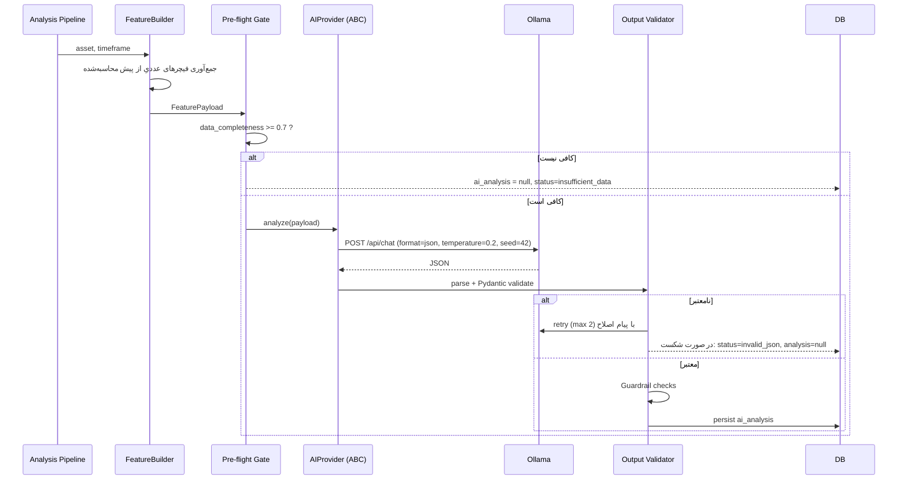

# ۶) AI Flow — نقش Ollama، قرارداد Prompt و Guardrails

## ۶.۱ خط قرمز معماری

> **LLM هیچ محاسبه عددی انجام نمی‌دهد.**
> RSI، MACD، ATR، Score، Entry/SL/TP، RR — همه در Python محاسبه و **فقط به‌عنوان ورودی** به LLM داده می‌شوند.

نقش LLM دقیقاً چهار چیز است:
1. **تفسیر** (Interpretation) — ترکیب نشانه‌ها در یک روایت منسجم.
2. **کشف تناقض** (Contradiction detection) — مثلاً «روند صعودی اما OBV نزولی».
3. **بیان ریسک** به زبان طبیعی فارسی.
4. **تولید Confidence کیفی** که در کنار Confidence آماری قرار می‌گیرد (نه جایگزین آن).

---

## ۶.۲ جریان



**Async و غیر مسدودکننده:** تحلیل AI در صف جداگانه اجرا می‌شود. API بلافاصله Score و Risk را
برمی‌گرداند و متن AI بعداً از طریق WebSocket (`ai.completed`) به UI می‌رسد.

---

## ۶.۳ ورودی — Feature Payload Contract (نسخه‌دار)

```json
{
  "schema_version": "features.v3",
  "symbol": "BTCUSDT",
  "market": "crypto",
  "timeframe": "4h",
  "as_of": "2026-09-26T08:00:00Z",
  "price": { "last": 63120.5, "change_24h_pct": -1.24 },
  "trend": { "direction": "bullish", "strength": "moderate", "adx": 28.6,
             "price_vs_ema20": "above", "price_vs_ema50": "above", "price_vs_ema200": "above",
             "ema_alignment": "bullish_stack" },
  "momentum": { "rsi_14": 58.4, "rsi_state": "neutral_upper",
                "macd_state": "positive", "macd_hist_slope": "rising",
                "stoch_k": 71.2, "stoch_state": "neutral" },
  "volatility": { "atr_pct": 1.96, "atr_percentile_90d": 0.62,
                  "bb_width_pct": 7.3, "vol_regime": "normal" },
  "volume": { "change_pct": 31.4, "vs_avg20": 1.31, "obv_slope": 0.42,
              "vwap_position": "above", "volume_spike": true },
  "levels": { "nearest_support": 60800, "nearest_resistance": 64500,
              "distance_to_resistance_pct": 2.18 },
  "market_regime": { "global": "BULL", "confidence": 0.68, "btc_dominance": 54.2 },
  "derivatives": { "funding_rate": 0.0091, "funding_percentile": 0.78,
                   "open_interest_change_24h_pct": 6.1, "long_short_ratio": 1.42 },
  "news": { "sentiment_score": 0.72, "impact": "high", "event_count_24h": 3,
            "top_events": ["تصویب ETF در حوزه X", "افزایش ورودی صرافی‌ها"] },
  "ml": { "prob_up": 0.61, "model_version": "xgb_dir_v7", "calibrated": true,
          "historical_accuracy_90d": 0.57 },
  "risk": { "risk_score": 32, "rr_ratio": 1.59, "max_drawdown_30d_pct": 12.4,
            "liquidity_score": 91, "veto": null },
  "scores": { "technical": 82, "momentum": 76, "volume": 81, "market": 73,
              "news": 88, "sentiment": 84, "final_preliminary": 84 },
  "data_quality": { "completeness": 0.96, "missing": [], "stale": [] }
}
```

نکات:
- مقادیر هم به‌صورت **عدد** و هم **برچسب کیفی** (`above`, `rising`, `normal`) داده می‌شوند تا مدل مجبور به مقایسه عددی نشود (LLMها در مقایسه عددی ضعیف‌اند).
- `schema_version` در `ai_analysis.input_features` ذخیره می‌شود تا تحلیل‌های گذشته قابل بازتولید باشند.

---

## ۶.۴ خروجی — AI Analysis Contract (اجباری، JSON Schema)

```json
{
  "schema_version": "analysis.v3",
  "summary_fa": "string (80..600 chars)",
  "trend_interpretation": "string",
  "supporting_factors": ["string", "..."],
  "opposing_factors": ["string", "..."],
  "contradictions": [ { "description": "string", "severity": "low|medium|high" } ],
  "risks": [ { "description": "string", "severity": "low|medium|high|critical" } ],
  "invalidation_conditions": ["string"],
  "confidence": 0.0,
  "confidence_reason": "string",
  "recommendation_hint": "BUY_CANDIDATE|WATCH|HOLD|WAIT|AVOID",
  "data_gaps": ["string"]
}
```

> `recommendation_hint` صرفاً **پیشنهاد** است. تصمیم نهایی را `DecisionPolicy` در Python می‌گیرد (I7).

---

## ۶.۵ System Prompt (نسخه v3 — خلاصه)

```
تو یک تحلیل‌گر ارشد بازار هستی که فقط داده‌های از پیش محاسبه‌شده را تفسیر می‌کند.

قوانین مطلق:
1. هیچ عددی را خودت محاسبه نکن. فقط از اعدادی که در ورودی آمده استفاده کن.
2. هیچ عددی را که در ورودی نیست، اختراع نکن.
3. هرگز قیمت آینده را پیش‌بینی نکن. هرگز از «قطعاً»، «حتماً»، «تضمین» استفاده نکن.
4. اگر data_quality.completeness < 0.7 بود، در data_gaps ذکر کن و confidence را پایین بگذار.
5. تناقض‌های بین سیگنال‌ها را صریح بیان کن؛ روایت یکدست مصنوعی نساز.
6. خروجی فقط JSON معتبر مطابق schema باشد. هیچ متن اضافه‌ای بیرون JSON ننویس.
7. زبان summary_fa فارسی روان باشد؛ نام‌های فنی (RSI, MACD, EMA) انگلیسی بماند.
8. توصیه مالی نده؛ فقط وضعیت را توصیف و ریسک‌ها را بیان کن.
```

پارامترها: `temperature=0.2`، `top_p=0.9`، `seed` ثابت، `format="json"`، `num_ctx` متناسب با مدل، `timeout=45s`.

---

## ۶.۶ Guardrails پس از تولید (اجرا در Python)

| بررسی | اقدام در صورت نقض |
|---|---|
| JSON معتبر و مطابق schema | retry ≤۲، سپس `status=invalid_json`, `analysis=null` |
| **Numeric Grounding**: هر عددی در متن باید در ورودی وجود داشته باشد (±۱٪) | حذف جمله یا رد کل خروجی |
| واژگان ممنوع: «قطعاً»، «تضمین»، «حتماً سود»، «۱۰۰٪» | رد + retry |
| ادعای قیمت هدف خارج از TP محاسبه‌شده | رد |
| `confidence` باید با `data_completeness` سازگار باشد (`confidence <= completeness + 0.1`) | clamp |
| طول و زبان `summary_fa` | رد |
| تشخیص hallucination نماد/رویدادی که در ورودی نبود | رد |

تمام ردها در `system_logs` با `event_code=AI_GUARDRAIL_REJECT` ثبت و در داشبورد Admin نمایش داده می‌شوند.

---

## ۶.۷ ترکیب Confidence نهایی

`ai_confidence` تنها یکی از سه مؤلفه است:

```
confidence_final = w1 · statistical_confidence   # کالیبراسیون مدل ML + عملکرد تاریخی ۹۰ روزه
                 + w2 · data_confidence          # data_completeness × quality_score
                 + w3 · agreement_confidence     # میزان توافق TA / ML / News / Regime
                 + w4 · ai_confidence            # خروجی LLM  (پیش‌فرض: w4 کوچک‌ترین وزن)
```
پیش‌فرض پیشنهادی: `w1=0.35, w2=0.25, w3=0.25, w4=0.15` — قابل تنظیم در `scoring_profiles`.

دلیل وزن پایین AI: LLM منبع حقیقت آماری نیست؛ ارزش اصلی‌اش توضیح‌پذیری است.

---

## ۶.۸ AIProvider — قابلیت تعویض (I4)

```text
AIProvider (ABC)
  ├─ name, model, capabilities
  ├─ analyze(payload: FeaturePayload, prompt_version: str) -> AIAnalysis
  ├─ health() -> bool
  └─ cost_estimate(payload) -> Cost | None

پیاده‌سازی‌ها:
  OllamaProvider    (پیش‌فرض، local)
  OpenAIProvider    (آینده)
  AnthropicProvider (آینده)
  GeminiProvider    (آینده)
  NullProvider      (AI خاموش — سیستم کامل کار می‌کند)
  MockAIProvider    (تست)
```
انتخاب از `.env`: `AI_PROVIDER=ollama`, `AI_MODEL=qwen2.5:14b-instruct`, `AI_FALLBACK=null`.
هیچ کد دیگری نیاز به تغییر ندارد.

**کش:** کلید کش = `hash(features_payload + prompt_version + model)`. اگر فیچرها به‌طور معنادار تغییر نکرده‌اند، LLM دوباره صدا زده نمی‌شود (صرفه‌جویی زیاد در CPU/GPU).

---

## ۶.۹ نمونه خروجی مورد انتظار (بند ۱۴)

```json
{
  "summary_fa": "روند کوتاه‌مدت صعودی است. قیمت بالاتر از EMA20 و EMA50 قرار دارد، حجم معاملات نسبت به میانگین ۲۰ دوره ۳۱ درصد افزایش یافته و MACD در ناحیه مثبت با هیستوگرام صعودی است. با این حال RSI در ۵۸.۴ به محدوده بالاتر نزدیک شده و فاصله تا مقاومت ۶۴٬۵۰۰ تنها حدود ۲.۲ درصد است. نسبت ریسک به بازده ۱.۵۹ محاسبه شده که مرزی است. بنابراین شرایط به‌عنوان فرصت قابل پایش ارزیابی می‌شود، اما ورود پرریسک تلقی می‌گردد.",
  "contradictions": [ { "description": "افزایش حجم همراه با نرخ فاندینگ در صدک ۷۸ می‌تواند نشانه ازدحام موقعیت‌های خرید باشد", "severity": "medium" } ],
  "risks": [ { "description": "نزدیکی به مقاومت کلیدی", "severity": "medium" },
             { "description": "نوسان در صدک ۶۲ نود روزه", "severity": "low" } ],
  "invalidation_conditions": ["بسته شدن ۴ ساعته زیر ۶۰٬۸۰۰", "افت OBV همراه با شکست EMA20"],
  "confidence": 0.79,
  "recommendation_hint": "WATCH"
}
```
