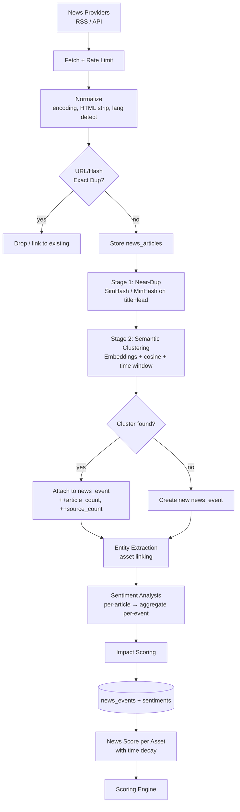

# ۷) News Flow — جمع‌آوری، Deduplication، Sentiment، Impact

## ۷.۱ مسئله اصلی

اگر ۲۰ سایت یک خبر را منتشر کنند، سیستم نباید ۲۰ سیگنال ببیند.
هدف: **20 Articles → 1 Event** (بند ۸).
اما توجه: تعداد منابع خودش یک **سیگنال** است (پوشش گسترده = اهمیت بیشتر)، پس حذف نمی‌شود بلکه به `source_count` تبدیل می‌شود.

---

## ۷.۲ Pipeline



---

## ۷.۳ استراتژی Deduplication سه‌مرحله‌ای

| مرحله | روش | هزینه | می‌گیرد |
|---|---|---|---|
| **L0 — Exact** | `sha256(normalized_url)` + `sha256(title+published_date)` | ناچیز | بازنشر دقیق، refetch |
| **L1 — Near-Duplicate** | **SimHash 64-bit** روی `title + first 200 chars`؛ Hamming distance ≤ 3 | خیلی کم | کپی با تغییر جزئی تیتر |
| **L2 — Semantic** | Embedding (`paraphrase-multilingual-MiniLM-L12-v2`، پشتیبانی فارسی) + cosine ≥ 0.82 + پنجره زمانی ۴۸ ساعت + اشتراک موجودیت | متوسط | همان رویداد با نگارش کاملاً متفاوت |

**ساختار خوشه‌بندی:** online incremental clustering
- هر مقاله جدید با centroid رویدادهای فعال (۴۸ ساعت اخیر) مقایسه می‌شود.
- اگر cosine ≥ threshold → عضو خوشه، centroid به‌روزرسانی.
- اگر نه → رویداد جدید.
- ذخیره بردارها: `pgvector` (اگر نصب باشد) یا Redis + index درون‌حافظه‌ای برای پنجره ۴۸ ساعت (تعداد کم → جستجوی خطی کافی است).

**نکته فارسی:** نرمال‌سازی متن فارسی الزامی است — تبدیل «ي/ك» عربی به «ی/ک»، حذف کشیده و نیم‌فاصله‌های نامنظم، یکسان‌سازی ارقام. بدون این، dedup فارسی شکست می‌خورد. (کتابخانه: `hazm` یا نرمال‌ساز سبک داخلی.)

---

## ۷.۴ لینک خبر به دارایی (Entity Linking)

سه روش، به‌ترتیب اولویت و هزینه:

1. **Dictionary/Alias matching** — جدول `asset_aliases` (BTC، بیت‌کوین، Bitcoin / فملی، ملی صنایع مس).
   سریع و دقیق برای کریپتو و نمادهای بورس.
2. **Rule/Regex + Sector mapping** — «فولاد»، «خودروسازی» → کل صنعت (scope=sector).
3. **LLM extraction (اختیاری، محدود)** — فقط برای مقالاتی که روش ۱ و ۲ چیزی پیدا نکردند و اهمیت بالقوه دارند. خروجی محدود به فهرست بسته نمادهای موجود (تا hallucination نداشته باشیم).

`news_event_assets.relevance` بر اساس: حضور در تیتر (وزن بالا) > لید > متن، و تعداد تکرار.

---

## ۷.۵ Sentiment Analysis

**رویکرد دولایه (بند ۹):**

| لایه | ابزار | کاربرد |
|---|---|---|
| **A — Lexicon/Rule** | واژگان مالی فارسی+انگلیسی (رشد، صعود، تحریم، توقف نماد، hack, ban, approval, listing) با شدت | baseline سریع، همیشه در دسترس |
| **B — Model** | مدل طبقه‌بندی مالی؛ انگلیسی: FinBERT-style، فارسی: ParsBERT fine-tuned یا zero-shot با LLM محلی | دقت بالاتر |
| **تجمیع** | میانگین وزنی با وزن اعتماد هر لایه؛ اختلاف زیاد بین دو لایه → `confidence` پایین | |

خروجی هر مقاله:
```
label ∈ {positive, negative, neutral}
score ∈ [-1, +1]
confidence ∈ [0, 1]
```

خروجی هر **رویداد** = تجمیع وزنی مقالات با وزن **اعتبار منبع** (`source_credibility` در `data_sources`).

### شدت (Intensity)
`low | medium | high | critical` — از ترکیب |score|، دسته رویداد، و source_count:
- `critical`: رویدادهای دسته `hack`, `regulation_ban`, `delisting`, `trading_halt` با پوشش ≥۵ منبع.

---

## ۷.۶ News Impact Score

```
impact = 100 × sigmoid(
     a1 · normalize(source_count)        # پوشش رسانه‌ای
   + a2 · avg(source_credibility)        # اعتبار منابع
   + a3 · |sentiment_score|              # شدت جهت‌دار
   + a4 · category_weight                # وزن ذاتی دسته (hack ≫ partnership)
   + a5 · velocity                       # سرعت انتشار: مقاله بر ساعت
   + a6 · asset_relevance                # ارتباط با نماد
)
```
همه ضرایب `a1..a6` در `scoring_profiles.weights.news` قرار دارند (I10).

### میرایی زمانی (Time Decay)
```
news_score(asset, t) = Σ_events  impact_e · relevance_e · sign(sentiment_e) · exp(-Δt / τ)
```
`τ` قابل تنظیم بر اساس بازار: کریپتو `τ ≈ 12h`، بورس ایران `τ ≈ 48h` (بازار کندتر واکنش نشان می‌دهد).
نتیجه به بازه 0..100 نگاشت می‌شود (۵۰ = خنثی).

---

## ۷.۷ خروجی نمونه (بند ۹)

```json
{
  "event_id": 8821,
  "canonical_title": "تصویب صندوق قابل معامله مبتنی بر اتریوم در بازار X",
  "category": "regulation",
  "first_seen_at": "2026-09-26T05:12:00Z",
  "article_count": 23,
  "source_count": 14,
  "assets": [ { "symbol": "ETH", "relevance": 0.95 }, { "symbol": "BTC", "relevance": 0.41 } ],
  "sentiment": { "label": "positive", "score": 0.68, "intensity": "high", "confidence": 0.91 },
  "impact_score": 84,
  "sources": ["Reuters", "CoinDesk", "..."]
}
```

---

## ۷.۸ کنترل کیفیت و ضد-دستکاری

| ریسک | کنترل |
|---|---|
| منابع اسپم / تبلیغاتی | `source_credibility` پایین + فهرست سیاه؛ مقالات با credibility < آستانه در Impact شرکت نمی‌کنند |
| خبرهای تکراری بازنشر‌شونده هفته‌ها بعد | فیلتر `published_at` خارج از پنجره + بررسی تازگی |
| Pump-and-dump با خبر جعلی | نیاز به حداقل ۲ منبع مستقل با credibility بالا برای `intensity ≥ high` |
| سوگیری زبان | dedup و sentiment جدا برای هر زبان، سپس تجمیع در سطح رویداد |
| نبود خبر ≠ خبر خنثی | اگر رویدادی نباشد، `news_score = null` و وزن آن **بازتوزیع** می‌شود، نه اینکه ۵۰ فرض شود |
