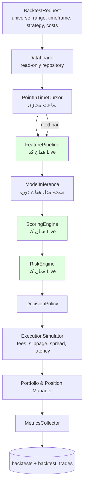
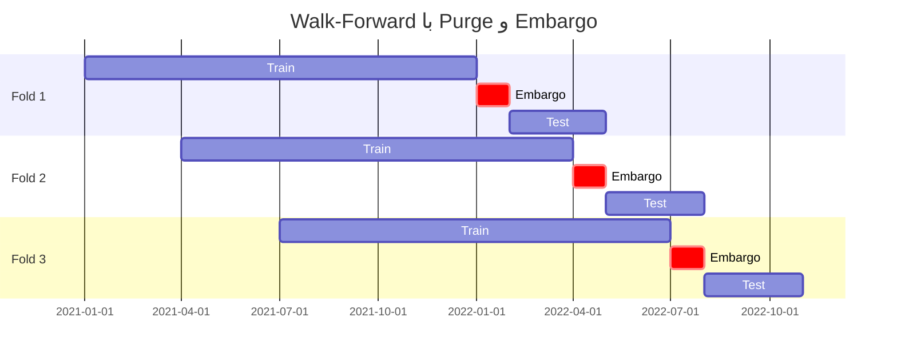

# ۸) Backtesting Architecture

## ۸.۱ هدف

پاسخ به یک سؤال: **«اگر این سیستم را N سال پیش روشن کرده بودیم، چه اتفاقی می‌افتاد؟»**
بدون پاسخ معتبر به این سؤال، هیچ Signal ای حق ندارد برچسب `BUY_CANDIDATE` بگیرد (بند ۳۲).

---

## ۸.۲ معماری

> کادرهای سبز = **دقیقاً همان کلاس‌های Live**. اگر کد Backtest و Live متفاوت باشد، نتیجه Backtest بی‌ارزش است.
> این با اصل «Pure Core» (سند 01) تضمین می‌شود: موتورها فقط `DataFrame` می‌گیرند و به منبع داده آگاه نیستند.

---

## ۸.۳ جلوگیری از Look-Ahead Bias (بند ۱۶)

| مکانیزم | توضیح |
|---|---|
| **Point-in-Time Cursor** | DataLoader هرگز بیش از `t` ردیف نمی‌دهد. دسترسی به `df` آینده در سطح API غیرممکن است (Slice محافظت‌شده). |
| **Candle Close Only** | تصمیم فقط روی کندل **بسته‌شده** (`is_final=true`). قیمت ورود = `open` کندل **بعدی**، نه `close` کندل فعلی. |
| **Indicator Warm-up** | برای هر اندیکاتور `min_periods` رعایت می‌شود؛ ردیف‌های warm-up کنار گذاشته می‌شوند. |
| **News Timestamp Discipline** | خبر فقط پس از `published_at` + تأخیر دریافت واقعی (`fetch_lag`) در دسترس است — نه لحظه انتشار. |
| **Model Version by Date** | در هر نقطه زمانی، مدلی استفاده می‌شود که در آن تاریخ **train شده بود** (`model_versions.trained_at <= t`). |
| **No Restated Data** | داده تعدیل‌شده (adjusted) با فاکتورهایی که در آن زمان معلوم بودند. corporate action آینده اعمال نمی‌شود. |
| **Survivorship Bias** | Universe در هر تاریخ از `assets.listed_at/delisted_at` ساخته می‌شود، نه از فهرست امروز. |
| **Test خودکار** | تست «کندل مسموم»: مقدار کندل آینده را به عدد نامعقول تغییر می‌دهیم؛ اگر خروجی Backtest تغییر کرد → نشت وجود دارد و CI شکست می‌خورد. |

---

## ۸.۴ جلوگیری از Data Leakage در ML

| مکانیزم | توضیح |
|---|---|
| **Time-Based Split** | هیچ `train_test_split(shuffle=True)`. فقط تقسیم زمانی. |
| **Purging** | نمونه‌هایی که برچسبشان با پنجره تست همپوشانی دارد از train حذف می‌شوند (Triple-Barrier → برچسب افق دارد). |
| **Embargo** | یک فاصله زمانی (مثلاً ۱× horizon) بین پایان train و شروع test خالی گذاشته می‌شود. |
| **Fit فقط روی Train** | Scaler / Imputer / Feature Selection فقط روی train؛ در `sklearn.Pipeline` تا در CV هم رعایت شود. |
| **بدون Target Encoding سراسری** | هیچ آماره‌ای از کل دیتاست. |
| **Cross-Sectional Normalization** | نرمال‌سازی نسبت به بازار در هر مقطع زمانی فقط با داده همان مقطع. |

**سه روش پشتیبانی‌شده:**
1. `simple_split` — فقط برای نمونه‌سازی سریع.
2. `walk_forward` (anchored / rolling) — **پیش‌فرض**.
3. `purged_kfold` با embargo — برای ارزیابی مدل، نه استراتژی.

---

## ۸.۵ شبیه‌سازی اجرا (Execution Realism)

بدون مدل هزینه واقع‌گرایانه، هر Backtest سودده است.

| مؤلفه | کریپتو | بورس ایران |
|---|---|---|
| **Fee** | taker ~0.10٪ (قابل تنظیم) | کارمزد خرید ~0.37٪، فروش ~0.88٪ (قابل تنظیم در config) |
| **Spread** | از order book تاریخی یا تخمین از ATR | از مظنه خرید/فروش |
| **Slippage** | مدل: `k · spread + λ · (order_size / ADV)^0.5` | همان + جریمه صف |
| **Latency** | ۱ کندل تأخیر تصمیم→اجرا | ۱ کندل |
| **Partial Fill** | بر اساس حجم کندل (حداکثر x٪ از volume) | بر اساس حجم |
| **محدودیت‌های خاص ایران** | — | **دامنه نوسان ±۵٪/۷٪**، **صف خرید/فروش** (اگر قیمت در سقف و حجم صفر → fill نمی‌شود)، **توقف نماد**، **حجم مبنا** |

> مدل‌سازی صف و دامنه نوسان برای بورس ایران **الزامی** است. بدون آن، Backtest سودهای غیرقابل تحقق نشان می‌دهد (چون در صف خرید نمی‌شد خرید).

---

## ۸.۶ متریک‌های خروجی

**سودآوری:** Total Return, CAGR, Profit Factor, Expectancy, Average R-Multiple
**ریسک:** Max Drawdown, Drawdown Duration, Volatility, VaR/CVaR 95%, Ulcer Index
**تعدیل‌شده با ریسک:** Sharpe, Sortino, Calmar
**رفتار معامله:** Win Rate, Avg Win/Loss, Payoff Ratio, Exposure %, Turnover, Avg Bars Held, MAE/MFE
**طبقه‌بندی (سطح مدل):** Accuracy, Precision, Recall, F1, ROC-AUC, **Brier Score** و **Calibration Curve**
**مقایسه‌ای:** در برابر **Buy & Hold** و در برابر **Random Signal** با همان نرخ معامله

> اگر استراتژی از Buy&Hold بهتر نیست، صادقانه در UI اعلام می‌شود.

---

## ۸.۷ کنترل Overfitting

| ابزار | کاربرد |
|---|---|
| **Out-of-Sample نهایی** | آخرین ۲۰٪ داده تا لحظه Promote **هرگز** دیده نمی‌شود |
| **Deflated Sharpe Ratio** | تصحیح Sharpe بابت تعداد آزمون‌های انجام‌شده |
| **Parameter Sensitivity Heatmap** | اگر سود فقط در یک نقطه پارامتری وجود دارد → overfit |
| **شمارش آزمون‌ها** | هر Backtest در DB ثبت می‌شود؛ تعداد کل در محاسبه DSR وارد می‌شود |
| **Monte Carlo / Bootstrap** | جابجایی ترتیب معاملات → توزیع Max Drawdown و Sharpe |
| **Regime Breakdown** | عملکرد جدا در BULL/BEAR/SIDEWAYS — استراتژی که فقط در گاوی کار می‌کند مشخص می‌شود |

---

## ۸.۸ حداقل‌های پذیرش (Promotion Gate)

یک استراتژی/مدل فقط با شرایط زیر به مرحله Paper می‌رود:

| شرط | مقدار پیشنهادی |
|---|---|
| تعداد معاملات OOS | ≥ ۱۰۰ |
| Sharpe (OOS، پس از هزینه) | ≥ ۰.۸ |
| Profit Factor | ≥ ۱.۲ |
| Max Drawdown | ≤ ۲۵٪ |
| بهتر از Buy&Hold در حداقل ۲ رژیم از ۳ | بله |
| Calibration Error (Brier) | ≤ baseline |
| پایداری در ≥ ۷۰٪ foldهای Walk-Forward | بله |

این مقادیر در `config/promotion_gates.yaml` قابل تنظیم‌اند.
