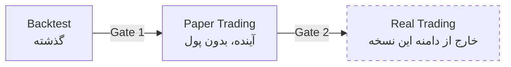
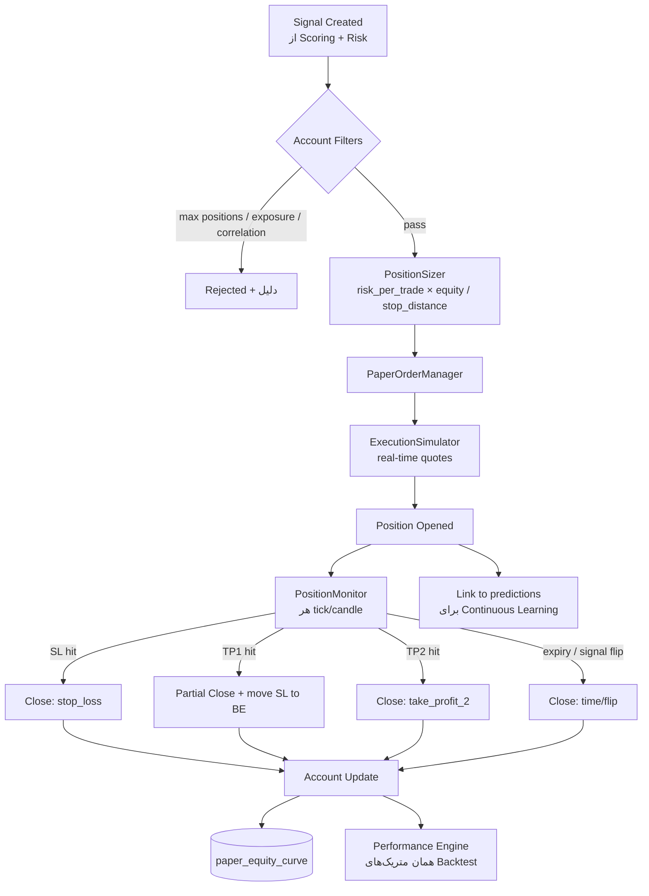

# ۹) Paper Trading Architecture

## ۹.۱ نقش در سیستم

Paper Trading **پل بین Backtest و واقعیت** است. Backtest روی گذشتهٔ معلوم اجرا می‌شود؛
Paper Trading روی آیندهٔ نامعلوم اما بدون ریسک پول.

هر چیزی که در Backtest عالی بود اما در Paper شکست خورد، یعنی Backtest نشتی داشته است.
**این تنها راه کشف نشت‌های باقی‌مانده است.**



> در این نسخه **هیچ اتصالی به معامله واقعی وجود ندارد** — نه کد، نه کلید API با مجوز trade.
> این یک تصمیم معماری است، نه یک ویژگی نیامده (بند ۱۷ و ۳۲).

---

## ۹.۲ معماری



---

## ۹.۳ تفاوت‌های کلیدی با Backtest

| جنبه | Backtest | Paper Trading |
|---|---|---|
| زمان | مجازی، سریع | واقعی، هم‌گام با بازار |
| داده | تاریخی کامل | لحظه‌ای، ناقص، گاهی قطع |
| قیمت اجرا | از کندل | از `bid/ask` زنده |
| قطعی داده | وجود ندارد | **وجود دارد** — باید مدیریت شود |
| نتیجه | آماری | واقع‌گرایانه‌تر، اما نمونه کمتر |

**مدیریت قطعی داده در Paper:** اگر قیمت یک نماد `stale` شود (> ۳× timeframe)، مدیریت موقعیت متوقف نمی‌شود
بلکه به حالت `frozen` می‌رود، SL/TP ارزیابی نمی‌شود و رویداد در `system_logs` ثبت می‌شود.
در گزارش عملکرد، مدت `frozen` به‌عنوان «کیفیت اجرا» گزارش می‌شود — نه پنهان.

---

## ۹.۴ Position Sizing و Risk Controls

```
risk_amount   = equity × risk_per_trade_pct        # پیش‌فرض ۱٪
stop_distance = |entry − stop_loss|
qty           = risk_amount / stop_distance
qty           = min(qty, max_position_value / entry, liquidity_cap)
```

**محدودیت‌های حساب (قابل تنظیم):**
| کنترل | پیش‌فرض |
|---|---|
| Risk per trade | ۱٪ equity |
| Max concurrent positions | ۱۰ |
| Max exposure per asset | ۱۰٪ |
| Max exposure per sector/market | ۳۰٪ |
| Max correlated exposure (ρ>0.7) | ۴۰٪ |
| Daily loss limit | ۳٪ → توقف باز کردن موقعیت جدید تا روز بعد |
| Max drawdown circuit breaker | ۲۰٪ → غیرفعال‌سازی حساب + هشدار |

> Correlation Guard حیاتی است: ۱۰ آلت‌کوین لانگ = یک شرط روی بیت‌کوین، نه ۱۰ شرط مستقل.

---

## ۹.۵ مدیریت موقعیت

| رویداد | اقدام |
|---|---|
| رسیدن به TP1 | بستن ۵۰٪ + انتقال SL به نقطه سربه‌سر (قابل تنظیم) |
| رسیدن به TP2 | بستن کامل |
| رسیدن به SL | بستن کامل |
| Trailing Stop (اختیاری) | `close − k·ATR` پس از TP1 |
| انقضای سیگنال | بستن در بازار |
| Flip سیگنال (long→short) | بستن + ثبت دلیل |
| توقف نماد (بورس ایران) | `frozen`، بدون اجرا |

---

## ۹.۶ چند حساب موازی (A/B Testing)

سیستم چند `paper_account` هم‌زمان پشتیبانی می‌کند تا پیکربندی‌ها مقایسه شوند:

| Account | Scoring Profile | Model | هدف |
|---|---|---|---|
| `baseline_ta` | فقط تکنیکال | — | مرجع کنترل |
| `full_ai` | همه لایه‌ها | xgb_v7 | پیکربندی اصلی |
| `no_news` | بدون وزن خبر | xgb_v7 | سنجش ارزش واقعی News Engine |
| `challenger` | پروفایل جدید | xgb_v8 | کاندید جایگزینی |

این مهم‌ترین ابزار برای پاسخ به سؤال «آیا لایه X واقعاً ارزش افزوده دارد؟» است.

---

## ۹.۷ Gate عبور به مرحله بعد

| شرط | پیشنهاد |
|---|---|
| مدت اجرا | ≥ ۹۰ روز تقویمی |
| تعداد معامله بسته‌شده | ≥ ۵۰ |
| Sharpe | ≥ ۰.۷ |
| Max Drawdown | ≤ Backtest × ۱.۵ |
| انحراف Win Rate از Backtest | ≤ ۱۰ واحد درصد |
| Slippage واقعی vs مدل‌شده | انحراف ≤ ۵۰٪ |
| هیچ حادثه داده‌ای حل‌نشده | بله |

اگر «انحراف Win Rate» بزرگ باشد → **Backtest معتبر نیست** و باید علت (نشت یا مدل هزینه) پیدا شود، نه اینکه Paper نادیده گرفته شود.

---

## ۹.۸ اتصال به Continuous Learning (بند ۱۵)

هر موقعیت بسته‌شده:
1. به `predictions` مرتبط می‌شود (`actual_return`, `is_correct`).
2. به `model_metrics` با `stage=paper` اضافه می‌شود.
3. در داشبورد «Prediction Performance» نمایش داده می‌شود.
4. اگر عملکرد Live مدل زیر آستانه برود → هشدار **Model Drift** و بازگشت به مدل قبلی (rollback) به‌صورت خودکار پیشنهاد می‌شود (تأیید انسانی لازم است).
