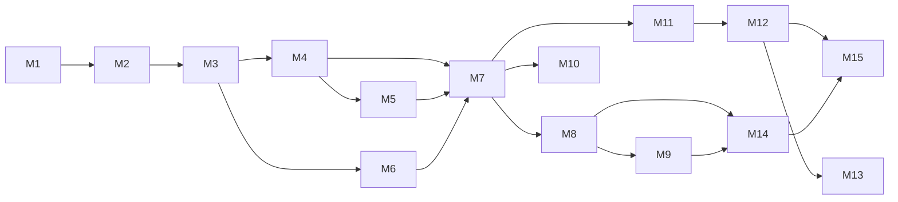

# ۱۱) Development Roadmap — ۱۵ Milestone

هر Milestone دارای **Definition of Done (DoD)** است و باید **قابل اجرا و تست** باشد.
برآورد زمان برای یک توسعه‌دهنده تمام‌وقت است؛ اعداد نسبی‌اند نه تعهد.

---

## M1 — Project Setup  ⏱ ~3–4 روز
**خروجی:** اسکلت اجرایی.
- monorepo، `pyproject.toml`، ruff/black/mypy strict، pre-commit
- `docker-compose`: postgres+timescale, redis, ollama, backend, worker
- `core/config.py` (Pydantic Settings) + `.env.example`
- structlog با masking + `/health`, `/health/deep`
- CI: lint + type + test + gitleaks + `check_architecture.py`

**DoD:** `make up` بالا می‌آید، `/health/deep` وضعیت همه سرویس‌ها را برمی‌گرداند، CI سبز.

---

## M2 — Database  ⏱ ~4–6 روز
- تمام مدل‌های SQLAlchemy + Alembic migration اولیه
- Hypertables، ایندکس‌ها، compression policy، continuous aggregates
- Repository Pattern + تست‌های یکپارچه با testcontainers
- `seed_assets.py` برای دارایی‌ها/صرافی‌ها/منابع

**DoD:** `alembic upgrade head` روی DB خالی کار می‌کند؛ درج ۱M ردیف OHLCV و کوئری آخرین ۵۰۰ کندل < 50ms.

---

## M3 — Market Data Providers  ⏱ ~1.5–2 هفته
- ABCها + Registry + rate limiter + retry/backoff/circuit breaker
- `BinanceProvider` (REST + WS)، `CoinGeckoProvider`
- حداقل یک `IranStockProvider` واقعی + لایه نرمال‌سازی نماد
- Validation + Normalization + quarantine + `data_source_health`
- Backfill تاریخی + Gap filler
- Mock providers فقط در تست

**DoD:** ۵ سال داده روزانه و ۱ سال ساعتی برای Universe اولیه در DB؛ قطع کردن اینترنت → خطای واضح، بدون داده جعلی، بازیابی خودکار.

---

## M4 — Technical Analysis  ⏱ ~1–1.5 هفته
- Indicator Engine + backendها + registry
- همه اندیکاتورهای بند ۶ + Trend/Momentum/Volatility/Volume Spike/Breakout
- Support/Resistance با روش مستند و بدون look-ahead
- ذخیره در `technical_indicators`، کش Redis برای timeframeهای پایین
- **تست عددی** در برابر مقادیر مرجع (TradingView/TA-Lib) با tolerance مشخص

**DoD:** برای هر نماد و timeframe، اندیکاتورها محاسبه و از API قابل خواندن؛ تست‌های عددی سبز.

---

## M5 — Market Regime  ⏱ ~4–6 روز
- Regime کریپتو (BTC/ETH/Total MCap/BTC.D)
- Regime بورس ایران (شاخص کل، هم‌وزن، ارزش معاملات، قدرت خریدار حقیقی، ورود/خروج پول)
- Regime صنعتی
- روش: ترکیب قواعد (EMA slope + ADX + realized vol percentile) با hysteresis برای جلوگیری از flip-flop

**DoD:** `/market/regime` برای هر scope مقدار + confidence + شواهد برمی‌گرداند؛ backfill تاریخی رژیم‌ها انجام شده.

---

## M6 — News Engine  ⏱ ~1.5–2 هفته
- News Providerها (RSS + API)، نرمال‌سازی فارسی
- Dedup سه‌مرحله‌ای (exact → simhash → embedding clustering)
- Entity linking، Sentiment دولایه، Impact Score با time decay
- API رویدادها

**DoD:** تست با مجموعه‌ای از ۲۰ بازنشر یک خبر → دقیقاً ۱ رویداد؛ precision/recall خوشه‌بندی روی مجموعه برچسب‌خورده دستی گزارش می‌شود.

---

## M7 — Scoring + Risk  ⏱ ~1–1.5 هفته
- Scoring Engine با componentهای مستقل و نرمال‌سازی cross-sectional
- `scoring_profiles` در DB + `/scoring/simulate`
- Risk Engine: Entry/SL/TP1/TP2/RR/position risk/vol/drawdown
- **Risk Veto** و `DecisionPolicy`
- Ranking Engine + Screener

**DoD:** برای هر دارایی ۹ امتیاز + final + recommendation؛ سناریوی «Technical=90 ولی RR=0.6» → خروجی `WAIT` (تست واحد).

---

## M8 — Backtesting  ⏱ ~2 هفته
- PointInTimeCursor + VirtualClock + ExecutionSimulator (شامل قواعد بازار ایران)
- Walk-Forward + purge/embargo، متریک‌های کامل، مقایسه با Buy&Hold
- تست‌های نشت (کندل مسموم)

**DoD:** اجرای Backtest ۳ ساله روی BTC و یک نماد بورسی با گزارش کامل؛ تست نشت سبز.

---

## M9 — Paper Trading  ⏱ ~1 هفته
- حساب‌ها، سفارش، موقعیت، مانیتور، equity curve
- کنترل‌های ریسک (correlation guard, daily loss limit, circuit breaker)
- چند حساب موازی برای A/B

**DoD:** حساب Paper روی داده زنده اجرا می‌شود، موقعیت باز/بسته می‌کند، performance API پاسخ می‌دهد.

---

## M10 — Ollama Integration  ⏱ ~1 هفته
- AIProvider ABC + OllamaProvider + NullProvider
- Prompt v1، JSON schema، validator، guardrails، cache، صف اختصاصی
- ذخیره در `ai_analysis` + رویداد WS

**DoD:** خاموش کردن Ollama → سیستم کامل کار می‌کند با `degraded`؛ ۱۰۰ فراخوانی متوالی بدون خروجی نامعتبر ذخیره‌شده.

---

## M11 — Electron UI (پایه)  ⏱ ~2 هفته
- Electron shell امن (contextIsolation, بدون nodeIntegration در renderer)
- RTL + Vazirmatn + تم تیره/روشن + i18n فارسی
- Dashboard, Market Overview, Asset List با فیلترها, صفحه تنظیمات
- اتصال REST + WS، نمایش بنر منابع down، Disclaimer دائمی

**DoD:** اپ بسته‌بندی‌شده اجرا می‌شود و داده واقعی نشان می‌دهد.

---

## M12 — Charts  ⏱ ~1.5 هفته
- Lightweight Charts + کندل + حجم + EMA/SMA/BB
- Paneهای همگام RSI/MACD/ATR
- خطوط S/R و مارکرهای Entry/SL/TP و سیگنال AI
- روشن/خاموش کردن اندیکاتورها + ذخیره تنظیمات
- لایه Drawing ساده (خط روند، خط افقی، مستطیل)

**DoD:** صفحه تحلیل دارایی با چارت کامل و AI Panel و News Panel.

---

## M13 — Alerts  ⏱ ~4–6 روز
- موتور قواعد + همه شرط‌های بند ۲۴ + cooldown
- Desktop Notification؛ Interface کانال برای Telegram/Email آینده

**DoD:** ساخت قانون در UI → دریافت نوتیفیکیشن واقعی در شرایط واقعی بازار.

---

## M14 — Machine Learning  ⏱ ~2–2.5 هفته
- Triple-barrier labeling، dataset builder، walk-forward splits
- XGBoost + baseline، calibration (Platt/Isotonic)، feature importance
- Model registry، promotion gates، drift detection
- Prediction resolver + داشبورد عملکرد

**DoD:** مدل train شده، ارزیابی walk-forward گزارش شده، پیش‌بینی‌ها ذخیره و پس از سررسید خودکار resolve می‌شوند.

---

## M15 — Testing, Hardening, Docs  ⏱ ~1.5 هفته
- پوشش تست هدف: ≥۸۰٪ روی `domain`, `indicators`, `risk`, `scoring`
- تست‌های بار، profiling کوئری‌ها، بهینه‌سازی
- امنیت: gitleaks، بررسی CSP در Electron، ممیزی لاگ‌ها
- مستندات کاربر + مستندات توسعه‌دهنده + installer

**DoD:** همه گیت‌های کیفی سبز، نصب‌کننده آماده.

---

## ترتیب و وابستگی‌ها

**مسیر بحرانی:** M1→M2→M3→M4→M7→M8. اگر زمان کم شد، M6 (News) و M14 (ML) قابل تعویق‌اند
چون سیستم بدون آنها هم خروجی معنادار می‌دهد (وزنشان در پروفایل صفر می‌شود).

## نقاط تصمیم (Checkpoint)
- **پس از M3:** آیا کیفیت داده بورس ایران کافی است؟ اگر نه، دامنه پروژه بازنگری می‌شود.
- **پس از M8:** آیا استراتژی از Buy&Hold بهتر است؟ اگر نه، به‌جای افزودن ویژگی، فرضیه‌ها بازنگری می‌شوند.
- **پس از M14:** آیا ML ارزش افزوده بر TA خالص دارد؟ (مقایسه با حساب `baseline_ta`)
