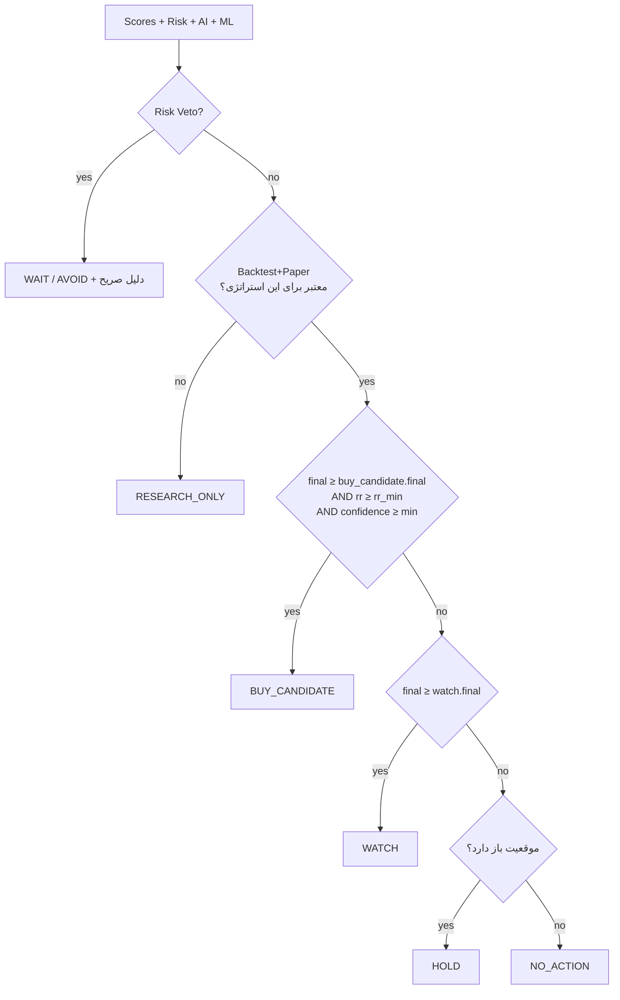

# ۱۶) Scoring Engine و Risk Engine — جزئیات

## ۱۶.۱ اصل نرمال‌سازی

مشکل رایج: «RSI = 58 یعنی چند امتیاز؟» — پاسخ مطلق ندارد.
راه‌حل: **نرمال‌سازی مقطعی و تاریخی**، نه آستانه‌های ثابت.

| روش | کاربرد |
|---|---|
| **Percentile Rank تاریخی** (۲۵۲ روز) | مقایسه دارایی با خودش (ATR، حجم، funding) |
| **Cross-Sectional Rank** | مقایسه دارایی با هم‌گروه‌هایش در همان لحظه (مومنتوم، حجم) |
| **Piecewise Mapping** | برای اندیکاتورهای با معنای ذاتی (RSI، ADX) با پارامترهای YAML |
| **Z-Score با Winsorization** | جلوگیری از اثر داده پرت |

**نکته حیاتی:** مقایسه مقطعی فقط در **گروه همتا** انجام می‌شود (کریپتو با کریپتو، سهام با سهام هم‌صنعت).
مقایسه حجم بیت‌کوین با حجم یک نماد کوچک بورسی بی‌معناست.

---

## ۱۶.۲ اجزای امتیاز

هر Component یک کلاس مستقل با امضای یکسان است:

```
Component.compute(features, context) -> ComponentResult
  ComponentResult { value: 0..100, confidence: 0..1,
                    breakdown: dict[str, float], missing: list[str] }
```

| Component | ورودی‌های اصلی |
|---|---|
| **Technical** | جهت و قدرت روند (EMA stack, ADX)، موقعیت نسبت به EMAها، وضعیت Ichimoku، فاصله تا S/R |
| **Momentum** | RSI، MACD hist و شیب آن، Stochastic، ROC چنددوره‌ای، مومنتوم نسبی به بازار |
| **Volume** | نسبت حجم به میانگین ۲۰، شیب OBV، موقعیت نسبت به VWAP، Volume Spike، تأیید حجمی شکست |
| **Market** | رژیم بازار + همبستگی دارایی با بازار + قدرت صنعت (سهام) / BTC.D (کریپتو) |
| **News** | News Score با میرایی زمانی (سند ۰۷) |
| **Sentiment** | تجمیع احساسات رویدادها + Fear&Greed (کریپتو) + قدرت خریدار حقیقی (ایران) |
| **Liquidity** | ارزش معاملات، عمق order book، spread، ADV، ریسک صف (ایران) |
| **AI Confidence** | خروجی LLM پس از Guardrails |
| **ML** | احتمال کالیبره‌شده مدل |

---

## ۱۶.۳ ترکیب نهایی

```
raw = Σ_i  w_i · s_i · c_i        روی componentهای موجود
Σw  = Σ_i  w_i · c_i

final_pre = raw / Σw                       ← بازتوزیع خودکار وزن اجزای غایب
final     = clamp(final_pre · risk_adjuster, 0, 100)

risk_adjuster = 1 − β · (risk_score / 100)   ، β از پروفایل (پیش‌فرض ۰.۴)
```

**چرا بازتوزیع به‌جای مقدار پیش‌فرض؟**
اگر خبری نباشد، فرض «خبر خنثی = ۵۰» یک سیگنال جعلی وارد می‌کند. بازتوزیع وزن، صادقانه‌تر است
و در عوض `confidence` کاهش می‌یابد (چون `data_completeness` پایین‌تر است). — اجرای بند ۲۹.

### نمونه محاسبه (مطابق مثال بند ۱۱)
```
Technical 82 (w .22) | Momentum 76 (w .15) | Volume 81 (w .12)
Market    73 (w .13) | News     88 (w .12) | Sentiment 84 (w .08)
Liquidity 91 (w .08) | ML       61 (w .10)
raw/Σw = 79.6   ;  risk 32 → risk_adjuster = 1 − 0.4×0.32 = 0.872
→ 69.4  ... سپس مقیاس‌دهی مقطعی به توزیع 0..100 → Final ≈ 84
```
> مقیاس‌دهی نهایی **مقطعی** است: امتیاز ۸۴ یعنی «در صدک ۸۴ فرصت‌های امروز»، نه یک عدد مطلق جهانی. این تفسیر را قابل فهم و پایدار می‌کند.

---

## ۱۶.۴ پیکربندی وزن‌ها (I10)

`config/scoring.yaml` فقط **seed** اولیه است؛ منبع حقیقت `scoring_profiles` در DB است.

```yaml
profile: default_crypto
weights:
  technical: 0.22
  momentum:  0.15
  volume:    0.12
  market:    0.13
  news:      0.12
  sentiment: 0.08
  liquidity: 0.08
  ml:        0.10
risk_beta: 0.4
confidence_weights: { statistical: 0.35, data: 0.25, agreement: 0.25, ai: 0.15 }
thresholds:
  buy_candidate: { final: 75, rr_min: 1.8, risk_max: 45, confidence_min: 0.6 }
  watch:         { final: 60, rr_min: 1.2 }
  avoid:         { risk_min: 75 }
```
پروفایل جداگانه برای `default_iran_stock` با وزن‌های متفاوت (مثلاً liquidity و sentiment حقیقی/حقوقی بالاتر).

**Optimization آینده:** جستجوی وزن‌ها با Bayesian Optimization روی **walk-forward** و با جریمه تعداد آزمون (سند ۰۸) — نه grid search روی کل تاریخچه.

---

## ۱۶.۵ Risk Engine (مستقل از AI — I6)

### محاسبه سطوح
```
ATR      = ATR(14) روی timeframe تحلیل
stop_loss = entry − k_sl · ATR        (k_sl پیش‌فرض ۱.۵، قابل تنظیم)
          یا نزدیک‌ترین Support معتبر زیر قیمت − بافر  ← هرکدام محافظه‌کارانه‌تر
tp1      = entry + k_tp1 · ATR        (پیش‌فرض ۲.۰)
tp2      = entry + k_tp2 · ATR        (پیش‌فرض ۳.۵)
          با تعدیل: اگر مقاومت معتبری قبل از TP باشد، TP به زیر آن منتقل می‌شود
rr       = (tp1 − entry) / (entry − stop_loss)
```
برای بورس ایران: فاصله SL نباید کمتر از دامنه نوسان روزانه باشد (وگرنه در یک روز عادی استاپ می‌خورد).

### Risk Score (0..100، بالاتر = بدتر)
```
risk = 100 × sigmoid(
    r1 · vol_percentile          # ATR% در صدک تاریخی
  + r2 · illiquidity             # 1 − liquidity_score/100
  + r3 · drawdown_30d
  + r4 · regime_penalty          # BEAR یا HIGH_VOLATILITY
  + r5 · news_risk               # رویداد منفی critical
  + r6 · crowding                # funding در صدک بالا / OI جهش‌دار
  + r7 · gap_halt_risk           # ریسک صف و توقف (ایران)
  + r8 · data_uncertainty        # 1 − data_completeness
)
```

### Risk Veto — قواعد رد قطعی (I7)
```
if rr < thresholds.rr_min                    → WAIT   "نسبت ریسک/بازده ناکافی"
if liquidity_score < min_liquidity           → AVOID  "نقدشوندگی ناکافی"
if data_completeness < 0.6                   → WAIT   "داده ناکافی"
if regime == HIGH_VOLATILITY and vol_pct>0.9 → WAIT   "نوسان فرین"
if halted or in_queue (ایران)                → WAIT   "امکان اجرا وجود ندارد"
if risk_score > thresholds.risk_max          → AVOID
if news has critical negative event <24h     → AVOID
```
**هیچ‌کدام از این‌ها توسط AI یا Score بالا قابل override نیستند.**
این دقیقاً خواسته بند ۱۲ است: «Technical Score بالا ≠ توصیه خرید».

---

## ۱۶.۶ DecisionPolicy — نقطه واحد تصمیم



خروجی همیشه شامل `reasons: list[str]` است — هر تصمیم قابل ردیابی و قابل ممیزی.

---

## ۱۶.۷ Ranking Engine

- رتبه‌بندی **درون گروه همتا** (کریپتو / سهام / صنعت)، نه یک لیست مخلوط.
- پایدارسازی با **hysteresis**: برای ورود به Top-10 امتیاز ۷۵ لازم است اما برای خروج زیر ۷۰ — تا لیست هر دقیقه نلرزد.
- تنوع‌بخشی: حداکثر N دارایی از یک صنعت در Top-10 (جلوگیری از لیستی که کل آن یک شرط واحد است).
- فیلترهای بند ۱۹ همگی روی همین موتور به‌صورت پارامتر اعمال می‌شوند.
